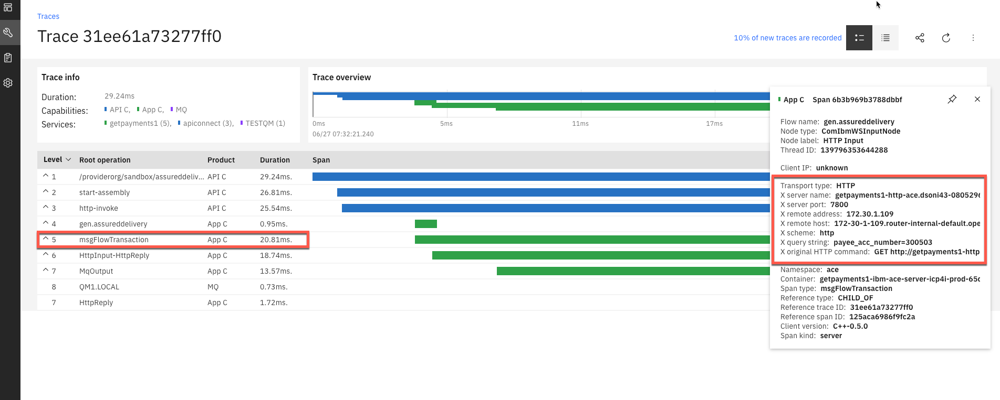

# Build and Deploy integrations and use fasp.io to transfer between two geo locations
   
### Introduction  

In this tutorial, we are going to create a banking integration application that gets invoked by an API. It uses integration capabilities to map the inbound request to a transaction that is sent over to MQ via fast and secure protocol (fasp.io) to another queue manager in Singapore. It also creates an event and publishes the event to a topic in Event Streams.

### Architecture 
  

In this tutorial, we have CP4I running in IBM Cloud in San Jose. This is where we will create the API, create integration flows and send the message over to MQ and Event Streams. When the message arrives on the local queue manager in San Jose, it is delivered over fasp protocol to MQ in Singapore.   

### Assumptions and Prerequisites
* This document assumes you have a basic working knowledge of MQ, API Connect, ACE and Event Streams. 
* A cloud pak for integration (CP4I) environment is deployed along with the following capabilities installed 
	- MQ   
	- Event Streams
	- App Connect Enterprise
	- API Connect. 
* A VM is deployed in a different geo location with MQ and fasp.io installed.
* App Connect Enterprise toolkit installed on the developers laptop

### This tutorial is broken into seven parts-
```
1	Configure IBM Aspera fasp.io   
2	Configure MQ   
3 	Configure Event Streams  
4	Configure an app connect enterprise flow to get message from the REST call, map it, send it to MQ and Event Streams.  
5	Expose the as an API	
6	Test the end to end flow
7	View the transactions using Operations Dashboard
``` 
### Estimated Time
80 minutes


-----------------------------------

# Let's start creating our integration!  

### Step 1- IBM Aspera fasp.io

IBM Aspera fasp.io is a lightweight software component for high-speed bidirectional data transport.

IBM Aspera fasp.io fully utilizes available bandwidth to transfer data in byte-order sequence at the maximum possible speed with near-zero latency. It removes the barriers of size, distance, and complexity to move data between on-premises and cloud infrastructures.

In this deployment, IBM Aspera fasp.io Gateway will be use to accelerate the communication between MQ in CP4i and a remote MQ in Singapore.


As today, fasp.io Gateway is not part of CP4i, so we need a VM running linux close to CP4i, in the same datacenter we are running the Openshift Cluster. We also need to run another fasp.io Gateway in Singapore, but we can reuse the server running MQ.

<maybe here we can add a diagram with this section described>

MQ1---TCP---**fasp.io GW1**---fasp over public internet---**fasp.io GW2**---TCP---MQ2


### Installation

We download the fasp.io binaries from [IBM Aspera Download website](https://www.ibm.com/aspera/downloads) under **IBM Aspera Streaming**.

Installation is as simple as running the following command:

`yum install ./ibm-fasp.io-gateway_version_arch.rpm`


### Configuration

All the Configuration for fasp.io Gateway is done under the file:

`/etc/fasp.io/gateway.toml`

In our case, in the CP4i VM side (fasp.io GW1), we will use the following configuration:

```
[[bridge]]
  [bridge.local]
      protocol = “tcp”
        host = “0.0.0.0"
        port = 54321

  [bridge.forward]
      protocol = “fasp”
        host = “161.202.162.183"
        port = 54321

```
The section **bridge.local** describes where the Gateway will be listening for local connections from the sender, in this case, MQ in CP4i (MQ1).

The section **bridge.forward** describes where the Gateway will be sending the received streams using IBM Aspera fasp protocol. In this case, it describes the IP and the port where the IBM Aspera fasp.io Gateway is listening in Singapore (fasp.io GW2).

In Singapore (fasp.io GW2), we have the following configuration file:

```
[[bridge]]
  [bridge.local]
      protocol = “fasp”
        host = “0.0.0.0"
        port = 54321

  [bridge.forward]
      protocol = “tcp”
        host = “127.0.0.1"
        port = 1414`
```

The section **bridge.local** describes where the Gateway is listening for fasp connections from another Gateway (fasp.io GW1). The port in this section has to be the same as the port in the **bridge.forward** section in the opposite fasp.io Gateway (fasp.io GW1). In this case: 54321.

The section **bridge.forward** describes where the Gateway will send the streams received. In this case, it is the local server (127.0.0.1), as MQ is running in the same server, and the port, 1414, is the port configured in MQ2 to received the data from the MQ1 in CP4i.

This configuration only covers one way. If we want to create a bidirectional configuration, we just need to replicate the configuration. One single fasp.io Gateway can manage multiple streams.


### Step 2- Configure MQ

***To learn the basics of MQ, go to https://developer.ibm.com/messaging/learn-mq/mq-tutorials/mq-dev-essentials/***

Next, we will configure both MQ queue managers as shown in this diagram. 


-	Start by defining a queue manager **TESTQM** in **San Jose**. Below are sample definitions required on both queue managers.

*NOTE: You can follow create a custom image with these definitions and create the queue manager. Go to https://github.ibm.com/cloud-integration-swat/creating-custom-mq-containers if you want create a custom image for MQ.*


**Definitions needed for each queue manager**

*San Jose Queue Manager*

```
1. Define and start a Listener. The following using the default port 1414.
define listener(LISTENER) trptype(tcp) control(qmgr) port(1414)
start listener(LISTENER)

2. Define a remote queue definition by typing the following command, we will use this queue in the message flow definition:  
define qremote(QM1.REMOTE) rname(QM1.LOCAL) rqmname(QM1) xmitq(QM1)

3. Define a local queue (used as a transmit queue):  
define QL(QM1) usage(xmitq) maxmsgl(104857600) TRIGGER TRIGTYPE(FIRST) TRIGDPTH(1) INITQ('SYSTEM.CHANNEL.INITQ') TRIGDATA('TESTQM.QM1')

4. Define a sender channel by typing the following command:  
define channel(TESTQM.QM1) chltype(SDR) conname ('connection_name(port)') xmitq(QM1) trptype(TCP) maxmsgl(104857600)


```

-	Next, let's define the queue objects on the queue manager in Singapore. We are calling the queue manager in Singapore QM1. 

*Singapore Queue Manager*
```
1. Define and start a Listener. The following using the default port 1414. 
define listener(LISTENER) trptype(tcp) control(qmgr) port(1414)
start listener(LISTENER)

2. Define a local queue:  
define qlocal(QM1.LOCAL)  maxmsgl(104857600) 

3. Define a receiving channel by typing the following command:  
define channel(TESTQM.QM1) chltype(RCVR) trptype(TCP)  maxmsgl(104857600)

```
### Step 3- Configure Event Streams
***To learn the basics of Event Streams, go to https://developer.ibm.com/components/event-streams/***

Next, we will configure Event Streams - the notification component in this diagram - 


1.	Create a topic in Event Streams by going to the event streams page and selecting create topic.  
  
Let's call it **moneydeposited**. Hit next and click **create topic** 

2. Now click on ***topics***, and select the topic you just created. Then click on ***connect to this cluster***

3. Copy the ***Bootstrap server address, generate an API Key*** for the application and download the ***PEM certificate***. We will need this later when we configure App Connect Enterprise.

### Step 4- Configure App Connect Enterprise
Next, we will configure an ACE flow that will do mapping and connect to MQ and Event Streams.  


1.	Project Interchange file is provided so you can import it into the toolkit. Below are the high-level instructions on building this flow.

2. In your toolkit workspace, create a new REST API project, and define the interface along with the model and then create the message flow.  
  
  

3. Next create the message flow and configure as shown below -  
	

	3a.	The configuration for Kafka producer node will look like this -  
	

	

	3b. The configuration for MQ should look similar to this -  
	     
    

4. Create the bar file.  
	4a.	In your toolkit, File --> New --> Bar FIle.
	4b. Give it a name  
	


5.	Before you can deploy the bar file in cloud pak for integration, you have to generate a secret.  

	a.	Generate Secret to connect to event streams topic. You can follow  **Appendix A -ACE-to_EventStreams-Connection** document in the bottom of this document.
	
	b.	After the secret is generated. You are now ready to deploy the broker archive (BAR) file.  
	
	c.	Go to your cloud pak for integration console, select App Connect Dashboard instance ACE.  
	 
	
	d.  Select Toolkit. Select Next
	
	e. 	Fill out the helm chart as follows -  
	
	
	f. 	Select ***show everything*** on the left side of the screen and scroll down to ***Integration Server***.  
	
	
	g.	Your ace flow should be started. Check logs if its not started.

### Step 5- Expose the flow as an API
So far, you have created an integration that connects with MQ in San Jose that sends over transactions to a queue manager in Singapore. And the integration also generates an event that sends an event notification to a topic. Now, we will create an API for this integration so you can expose it to the external developers in a secure manner. In the next few steps, we will create an API and a product with plans and publish the product so that it is available to developers.


 Let's get started - 

1.	Import the yaml file into API Connect. Go to the main page of API Connect instance and select develop and then add.  


2.	Once you import the yaml, it should open up the design view of the API. Under Schemas, make sure that HTTPS is selected.

3. Under security, click add and select clientId.  


4. Go to assembly, click on invoke, and select edit the URL to pass the target-url and request.path as shown below.  


5. We can test this API here. Select the play button. Publish the API, then put in the payee_acc_number and select invoke.  
  

6. Response should come back with status code of 200.  
  

### Create a product and publish on the developer portal  
1.	Go back to the main page for API Manager, Develop APIs and Products. Select ADD, product, New Product. Give it a name and select NEXT.  
  

2.	Select the API to add. In our case it will be SendtransactionsandEvents.  

3.	Create a free plan and select rate limiting if you like. Select NEXT. We can make it visible to the public and select next. It will create a new product.

4. Let's publish the product to the developer portal.  You can find the link to your developer portal by going to APIC console on CP4I, select Manage, select Catalog (Sandbox, in our case), settings and portal. You will see your portal URL there.  
   
  

5. Select the environment to publish to. In our case it's our sandbox environment.

6. Now go to the portal and test out the API. Log into the Developer Portal. 

7. Select the product that we just created - Send Transactions and Events 1.0.0.

8. Select the "Free" plan to subscribe to.

9.	Select App that will subscribe to this plan.

10.	Confirm Subscription.

11.	Now click on the product that you just subscribed to and select GET /pmts  
  

12. Test the new API by selecting **Send**  

### Step 6- Test the end to end flow   
 

1.	Invoke the API using the developer portal  
 

2. By Invoking this API, you should now see a message on the queue in Singapore Data Center. Browse the queue using MQ Explorer or amqsbcg or other tools you typically use to browse queues. You will see the following message on the queue.  
 

3. You should also see an event message generated in event streams. Go to Event Streams topic "MoneyDeposited" in Cloud Pak for Integration. GO to **Messages**, and select the partition.  
 


### Step 7- Using Operations Dashboard
Cloud Pak for Integration - Operations Dashboard Add-on is based on Jaeger open source project and the OpenTracing standard to monitor and troubleshoot microservices-based distributed systems. Operations Dashboard can distinguish call paths and latencies. DevOps personnel, developers, and performance engineers now have one tool to visualize throughput and latency across integration components that run on Cloud Pak for Integration. Cloud Pak for Integration - Operations Dashboard Add-on is designed to help organizations that need to meet and ensure maximum service availability and react quickly to any variations in their systems.

1.	Go to the IBM Pak Cloud Integration main page, click tracing to open the Operations Dashboard instance.

2.	In the Tracing page, check the Overview page. You see all products that you can use this tool: APIC ,APP Connect and MQ. (more tracing products will add in the future releases).  


3.	Go to tracing on the left, and here you will be able to see all the transactions that were sent. You can filter with **ClientID** in the add filter section and give it the client ID you have been testing with.  


4.  Click on a transaction, and it will bring you to the trace information for that transaction. On the top left, you will see all the capabilities and services that the transaction went through. Here you can see the latency for every action within the flow. 


5.  Click on the **msgFlowTransaction** and you will see more details of the transaction within that action. 


6.	Click on other operations and browse through other fields.

### Summary
This tutorial showed you how to - 

1. Create an API that invokes an Integration Flow. 
2.	Create an integration flow that generates events and publishes them to event streams.
3.	And sends a message to MQ over fast and secure protocol to different geo location.
4.	View tracing components for each capability used within Cloud Pak for Integration. 
5.	Without writing a single piece of code! 


-------

### About Authors - 

**Divya Soni** is a driven technologist with hands on experience in designing and implementing integration solutions on hybrid and multi-cloud platforms. She started her career in production support for integration products. During her tenure she wore multiple hats - from production support to architecture and then eventually leading CoE teams at major healthcare, financial and hospitality industries. 
Later, she pursued careers at Google and IBM to help customers on their hybrid cloud journey.  Currently, she is a member of the Tiger team at IBM where she continues to work with world wide customers and help them design their cloud native architecture and modernization strategies in messaging and integration.

**Certifications** - IBM Cloud; Google Cloud Architect; IBM Datapower Gateway; WebSphere MQ   
**Blogs** - https://medium.com/@iamdivyasoni  
**LinkedIn** - https://www.linkedin.com/in/iamdivyasoni/

**Fernando Boom** has been part of IBM Aspera organization since 2013. First in France, assisting European customers and then in the US. He moved on different customer facing positions, always assisting customers with understanding the technology and its use cases, designing and troubleshooting complex architectures. Currently, he is a member of the Tiger team at IBM. 

-

# Appendix A
### Connecting App Connect Enterprise with Event Streams

### Introduction
The instructions below will outline the steps to connect ACE flow with event streams.   

### Prerequisites
* This article assumes you have working knowledge of Cloud Pak for integration, ACE toolkit and Event Streams. 
* You have an existing ACE Flow that uses a Kafka Consumer or producer node
* You have an existing CP4I environment with Event Streams running

### The instructions here are broken down in four parts
* Event Streams configuration 
* Message Flow configuration in the ACE toolkit
* Prepare App Connect Enterprise parameters to connect to Event Streams
* Deploy BAR file on ACE server

### Event Streams Configuration
* Go to your event streams environment, and get the following information:  
		Topic Name (Where you want to publish events to)
		
  		
    
  	
	- Copy the bootstrap server address. 
	- Create an API Key by going through the steps under API Key  
	- Download the PEM certificate 
	- Remember the password for the truststore: password. 
 	

### ACE toolkit message flow configuration 
* Go to your ACE message flow where you are using KAFKA node. In this example, I am using a Kafka Publisher node. Under Basic, give your Topic name; Bootstrap servers. 


* Go to security Tab, and under the security protocol drop down select "SASL_SSL".


* Follow the standard process of creating a new bar file.

### Prepare App Connect Enterprise parameters to connect to Event Streams
* Download the config directory from this repo to your local filesystem.  
 We will work with the following files:  
	```serverconf.yaml```   
	```setdbparms.txt```     
	```truststoreCert-mykey.crt```  
	```truststorePassword.txt```    
* Go to your desktop and untar the config directory to a location of your choice and then change directory into that location. In the next few steps, we will edit some of these files. 

* Open the previously downloaded **es-api-key.json** and copy the api key between **" "**. Edit **setdbparms.yaml** file to include the API key right after token like this. (You need to copy the Event Streams API Key here.) :  

		
* Next you will use the PEM certificate **es-cert.pem** that you previously downloaded. In your terminal window copy the **es-cert.pem** to the config directory. Copy it as **truststoreCert-mykey.crt**. This is the cert name **generatesecrets.sh** looks for when executed.

* Log into your openshift environment with CLI. You can copy the login command from the Openshift console in the top right corner under your ID. 

* Once logged in, type ```oc project ace``` 
* In the config directory, edit **truststorePassword.txt** and add the password in the file. In our case, password is **password**.

* Your **config** directory should look like this. The arrow points to all the files that will be used to generate the secret. 


* From the config directory, execute **./generateSecrets.sh my-secret**

* To verify that your secret was created, go to the openshift console and verify that your secret looks like this:
Go to your openshift console --> ACE Namespace --> Resources --> Secrets --> my-secret.  
   
  


### Deploy App Connect BAR file on App Connect Enterprise Server
* Go into Cloud Pak for Integration and deploy a new server using your BAR file.
* Fill in all the details as you normally would. 
* Scroll down, locate **Integration Server** configuration. Type **mykey** into **List of Certificate aliases for the truststore**, you created as **truststoreCert-mykey.crt**. 
* Enter the name of the secret: **my-secret**
* Select **Install**

### Test
* Once the install is successful, test your flow and you should see an event in a topic in Event Streams. 
